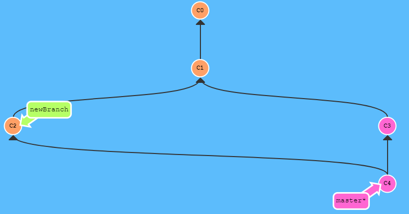
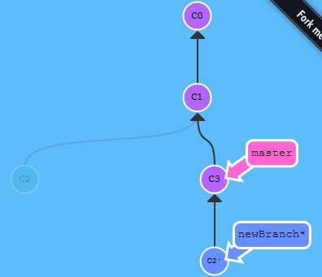
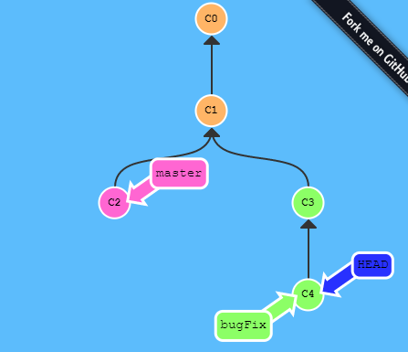
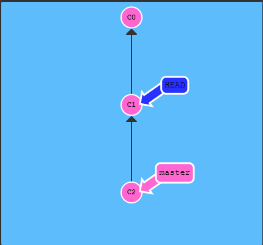
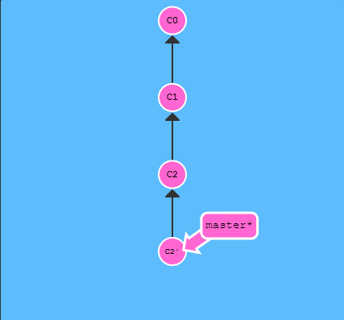
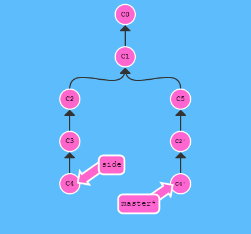

# git笔记

## 以下就是一些git常用的命令

* clone
```js
 git clone
```

- 列出分支
```js
  git branch
```

- 列出远程分支
```js
  git branch -a
```

- 检出新分支
```js
  git checkout -b newBranch
```

- 去除所有更改
```js
  git checkout .
```

- 添加文件
```js
  git add .
```

- 提交
```js
  git commit -m 'xxx'
```

- 推送到远程分支
```js
  git push origin master
```

- 查看提交日志
```js
  git log
```

- 合并分支

```js
  git merge master

  git merge newBranch
```
(其实就是把一个分支的提交信息copy一份到另一个分支，两个分支的提交就都是最新的了)




- rebase
(比较规范化，历史提交记录直观的方式，看似按顺序开发，实际是并行开发，把当前分支向着master移动保持最新)

```js
    git rebase master
```



## 关于HEAD

- HEAD是一个对当前检出记录的符号引用 —— 也就是指向你正在其基础上进行工作的提交记录。

- HEAD 总是指向当前分支上最近一次提交记录。大多数修改提交树的 Git 命令都是从改变 HEAD 的指向开始的。

- HEAD 通常情况下是指向分支名的（如 newBranch）。在你提交时，改变了 bugFix 的状态，这一变化通过 HEAD 变得可见。

```js
    git checkout c4
```



- 相对引用 ^ 和  ~
 
 (调整HEAD的指向位置, 一个^表示向上移动一位，即上一次提交记录)

 ```js
    git checkout master^
```


(一个~后面接数字表示移动几位)

 ```js
    git checkout master HEAD~2
```

- 重置reset，revert
 ```js
    // reset 后面跟提交记录的hash值，重置到该提交位置
    git reset c2
    // revert 后面跟hash值，重置并保留上次提交记录
    git revert c2
```



- git Cherry-pick

(最直接的将某些需要的提交复制到当前分支节点)

```js
    git Cherry-pick c2 c4
```



- 交互式rebase合并提交记录

```js
    // 在弹出框里面可以编辑 增删改里面的提交记录
    git rebase -i HEAD~4
```

