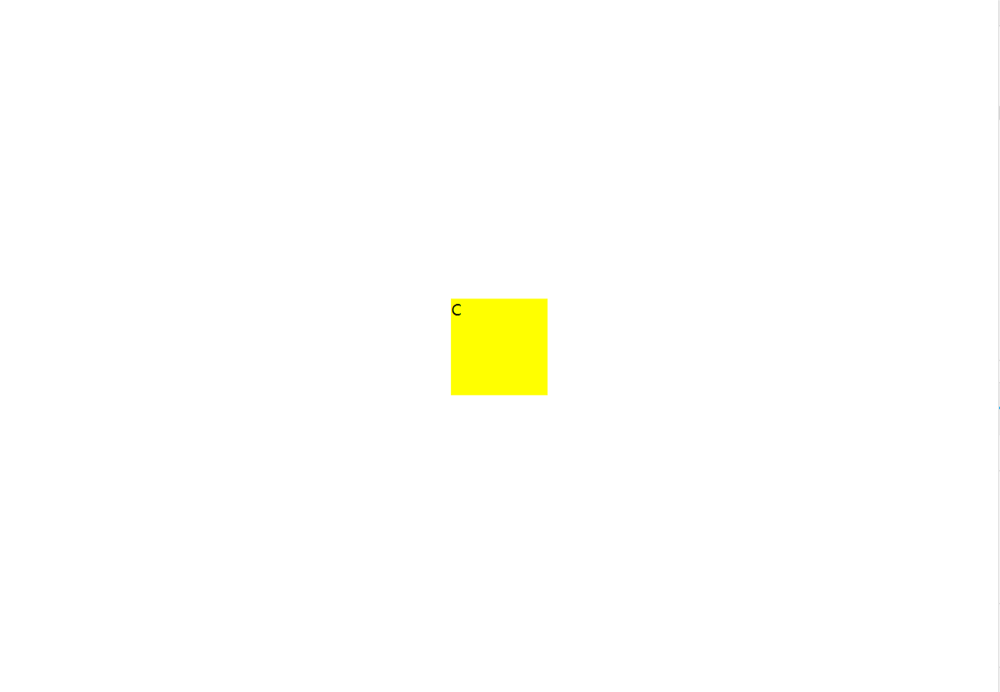
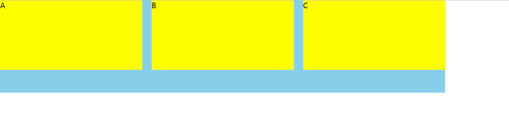

# 页面布局

## 1. 水平垂直居中

```css

    /* transform + position */
    .wrapper{
        position: relative;
    }
    .content{
        position: absolute;
        width: 100px;
        height: 100px;
        top: 50%;
        left: 50%;
        transform: translate(-50%, -50%);
    }

    /* flex */
    .wrapper{
        display: flex;
        align-items: center;
        justify-content: center;
        height: 100vh;
        width: 100%;
    }
    .content{
        width: 100px;
        height: 100px;
    }

    /* margin + position */
    .wrapper{
        position: relative;
    }
    .content{
        width: 100px;
        height: 100px;
        position: absolute;
        top: 50%;
        left: 50%;
        margin-top: -50px;
        margin-left: -50px;
    }

    /* table-cell  */
    .wrapper{
        display: table-cell;
        width: 100vw;
        text-align:center;
    }

    .content{
        width: 100px;
        height:100px;
        display: inline-block;
    }

    ...

```




## 2. 多列布局

- `左边定宽 右边不定宽`

```css
    /* 1.margin */
    .left{
        width: 100px;
        float:left;
    }
    .right{
        margin-left: 100px;
    }

    /* 2.overflow:hidden */

    .left{
        width: 100px;
        float:left;
    }

    .right{
        overflow: hidden;
    }

    /* 3.table-cell */
    .parent{
        display: table;
        table-layout: fixed;
    }
    .left, .right{
        display: table-cell;
    }
    .left{
        width:100px;
    }

    /* flex */
    .parent{
        display: flex;
    }
    .left{
        width:100px;
    }
    .right{
        flex: 1
    }

    ...

```

- `等高布局`

借助table-cell和flex

- `等宽布局`

```css
    /* display:table */
    .parent{
        display: table;
        table-layout:fixed;
        height:200px;
    }
    .column{
        display: table-cell;
        padding-left: 20px;
    }
    /* flex */
    .parent{
        display:flex;
        width: 100%;
        height:300px;
    }
    .column{
        flex: 1;
        height: 150px;
    }
    .column + .column{
        margin-left:20px;
    }

```




- `中间不定宽，两边定宽`

```css
    .left{
        width: 100px;
        float: left;
    }
    .right{
        float: right;
        width:100px;
    }
    .center{
        overflow: hidden;
    }

    /* 以及flex和table写法，都差不多 */

```


